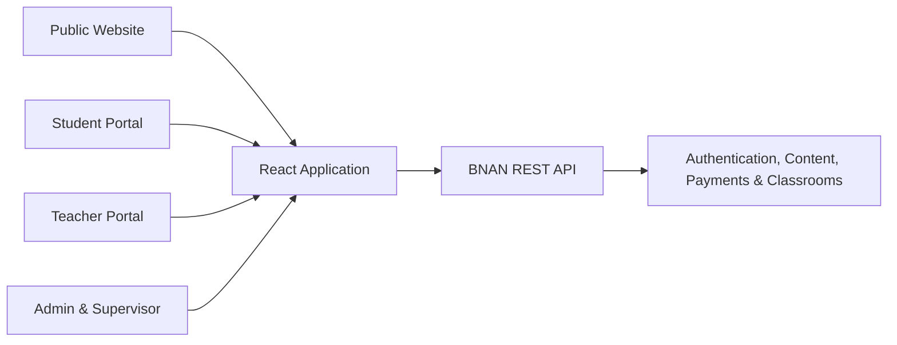

<div align="center">
  

  # BNAN Academy

  **A modern learning platform for Saudi, Egyptian, and Gulf curricula.**

  [](https://react.dev/)
  [](https://www.typescriptlang.org/)
  [](https://vitejs.dev/)
  [](https://tailwindcss.com/)
  [](https://vitest.dev/)

  [Live Website](https://bnanacademysa.com) · [Report an Issue](../../issues)
</div>

---

## Overview

BNAN Academy is a bilingual online education platform designed to connect students and teachers through structured curricula, live classes, course content, and classroom tools.

This repository contains the public website, student and teacher portals, and administrative dashboard. The application is built as a responsive single-page application and communicates with a separate production API.

## Features

- Arabic and English language support
- Curriculum and course discovery
- Student registration and teacher applications
- Role-based student, teacher, supervisor, and administrator access
- Class schedules and session management
- Classroom recordings and live lesson tools
- Zoom account and virtual classroom management
- Tamara and Paymob payment return flows
- Legal content, testimonials, ratings, and success-story management
- Responsive interface with SEO metadata support

## Technology Stack

| Area | Technologies |
| --- | --- |
| Core | React 18, TypeScript, Vite 5 |
| Styling | Tailwind CSS, shadcn/ui, Radix UI |
| Routing | React Router |
| Data | TanStack Query, Fetch API |
| Forms | React Hook Form, Zod |
| Motion & Charts | Framer Motion, Recharts |
| Testing | Vitest, Testing Library |
| Deployment | Cloudflare Pages |

## Getting Started

### Prerequisites

- [Node.js 20](https://nodejs.org/) — the expected version is defined in `.nvmrc`
- npm

### Installation

```bash
git clone <repository-url>
cd bnan-source-code
npm ci
```

### Development

```bash
npm run dev
```

The development server runs at [http://localhost:8080](http://localhost:8080).

> [!NOTE]
> The frontend currently communicates with `https://api.bnanacademysa.com/api/v1`. An internet connection is required for authentication and data-driven features.

## Available Scripts

| Command | Description |
| --- | --- |
| `npm run dev` | Start the Vite development server |
| `npm run build` | Create an optimized production build in `dist` |
| `npm run build:dev` | Build the application in development mode |
| `npm run preview` | Preview the production build locally |
| `npm run lint` | Analyze the codebase with ESLint |
| `npm test` | Run the test suite once |
| `npm run test:watch` | Run tests in watch mode |

## Project Structure

```text
src/
├── admin/       # Administration, classrooms, and Zoom management
├── api/         # API client, domain requests, and shared types
├── assets/      # Images and other visual assets
├── components/  # Shared application and UI components
├── data/        # Static application data
├── hooks/       # Custom React hooks
├── i18n/        # Language state and localization
├── layouts/     # Shared page and dashboard layouts
├── lib/         # Utilities and supporting services
├── pages/       # Public-facing application pages
├── portal/      # Student and teacher portal features
└── test/        # Shared test setup
```

## Architecture



The frontend uses React Router for client-side navigation, TanStack Query for server-state workflows, and a centralized API client for authentication, token refresh, and error handling.

## Production Build

Create and preview an optimized build locally:

```bash
npm run build
npm run preview
```

## Deployment

The project is configured for deployment on Cloudflare Pages.

| Setting | Value |
| --- | --- |
| Framework preset | Vite |
| Build command | `npm run build` |
| Output directory | `dist` |
| Node.js version | `20` |

To deploy:

1. Connect the GitHub repository from **Cloudflare Workers & Pages**.
2. Apply the build settings shown above.
3. Deploy the project.
4. Add the production domains under **Custom domains** if required.

The deployment-related files are:

- `public/_redirects` — provides the SPA fallback required by React Router.
- `public/_headers` — defines security and caching headers.
- `.nvmrc` — pins the expected Node.js major version.

## Backend

This repository contains the web frontend only. Authentication, content, payments, scheduling, and classroom services are provided by a separate backend. The current API endpoint is defined in `src/api/client.ts`.

## Quality Checks

Before submitting a change, run:

```bash
npm run lint
npm test
npm run build
```

## Contributing

1. Create a branch for your change.
2. Keep changes focused and follow the existing project conventions.
3. Add or update tests when behavior changes.
4. Run the quality checks locally.
5. Open a pull request with a clear description and verification notes.

---

<div align="center">
  Built for <a href="https://bnanacademysa.com">BNAN Academy</a>.
</div>
